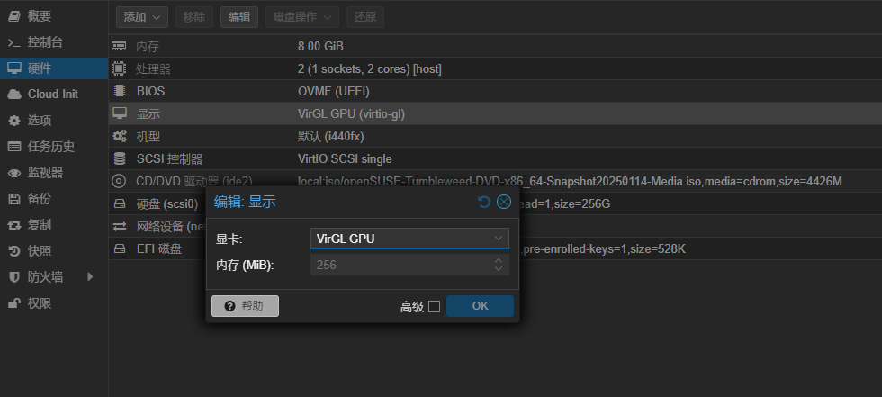
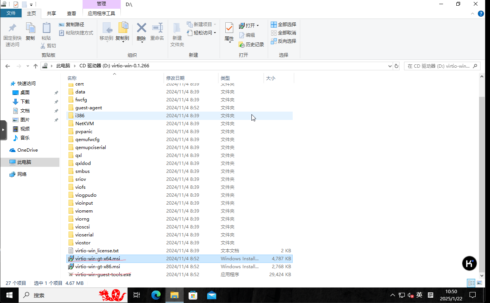
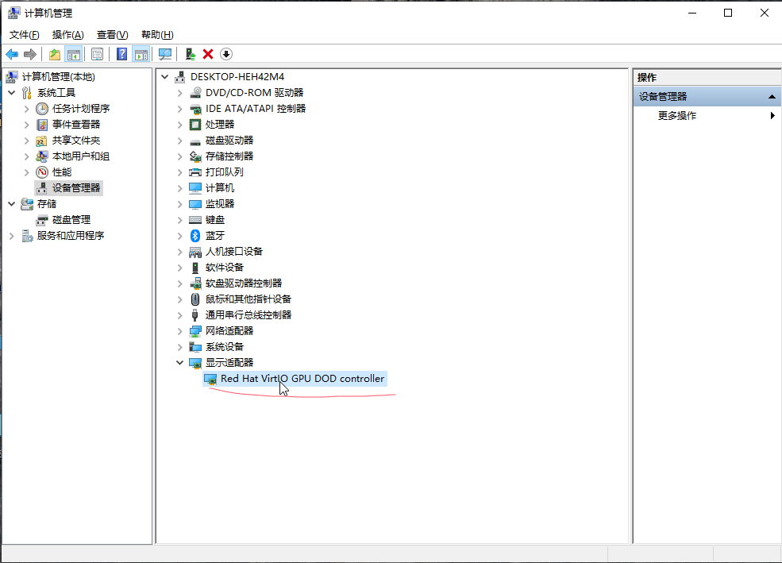
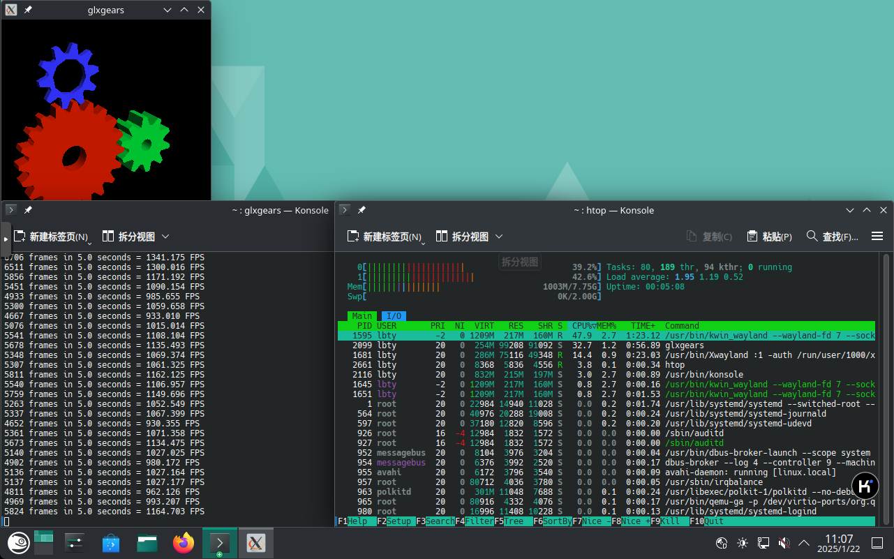

# 如何在PVE8.3中使用VirGL GPU虚拟化

## Tips

至少要有gpu核显独显都可以,但是无法加速microsoft directx,Vulkan虽然支持但还不成熟，OpenGL支持最好。所以不是很适合windwos，玩游戏的话最好选择OpenGL图形api的游戏例如java版的Mincraft。

## 使用VirGL GPU虚拟化

1. 安装开源的gpu驱动

```bash
apt install mesa libgl1 libegl1
```

2. 下载虚拟机用的[Windows_VirtIO_Drivers](https://pve.proxmox.com/wiki/Windows_VirtIO_Drivers)驱动,普遍情况是只有windwos才需要下载，大部分内核版本新一点的基本不需要，只要安装mesa就够了。

3. 修改虚拟机的显示配置为VirGl GPU
   

4. 宿主机中安装`mesa`或者[Windows_VirtIO_Drivers](https://pve.proxmox.com/wiki/Windows_VirtIO_Drivers)
   
   
   linux中加速的效果，以openSUSE tumbleweed举例。
   
